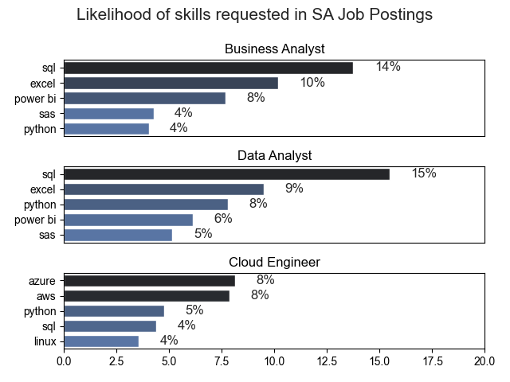
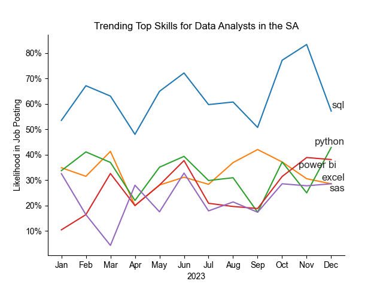
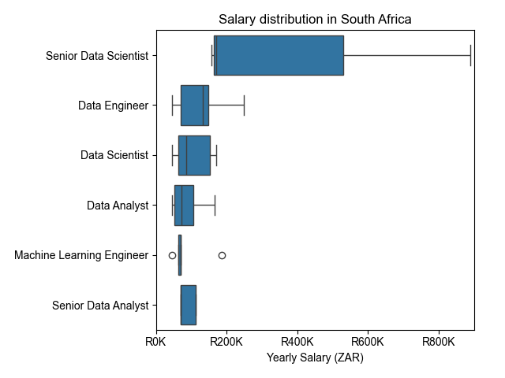
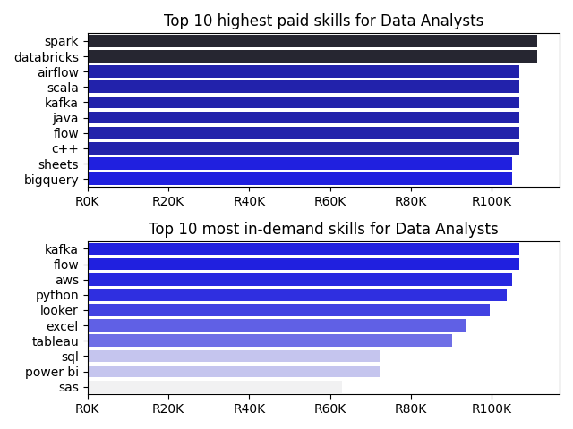

## Overview

Welcome to my analysis of the data job market, focusing on data analyst roles. This project was created out of a desire to navigate and understand the job market more effectively. It delves into the top-paying and in-demand skills to help find optimal job opportunities for data analysts.

The data sourced from [Luke Barousse's Python Course](https://www.lukebarousse.com/) which provides a foundation for my analysis, containing detailed information on job titles, salaries, locations, and essential skills. Through a series of Python scripts, I explore key questions such as the most demanded skills, salary trends, and the intersection of demand and salary in data analytics.

---

## The Questions

Below are the questions I want to answer in my project:

1. What are the skills most in demand for the top 3 most popular data roles?
2. How are in-demand skills trending for Data Analysts?
3. How well do jobs and skills pay for Data Analysts?
4. What are the optimal skills for data analysts to learn? (High Demand AND High Paying)

# Tools I Used

For my deep dive into the data analyst job market, I harnessed the power of several key tools:

- **Python:** The backbone of my analysis, allowing me to analyze the data and find critical insights.I also used the following Python libraries:
  - **Pandas Library:** This was used to analyze the data.
  - **Matplotlib Library:** I visualized the data.
  - **Seaborn Library:** Helped me create more advanced visuals.
- **Visual Studio Code:** My go-to for executing my Python scripts.
- **Git & GitHub:** Essential for version control and sharing my Python code and analysis, ensuring collaboration and project tracking.

# Data Preparation and Cleanup

This section outlines the steps taken to prepare the data for analysis, ensuring accuracy and usability.

## Import & Clean Up Data

I start by importing necessary libraries and loading the dataset, followed by initial data cleaning tasks to ensure data quality.

```python
# Importing Libraries
import pandas as pd
import matplotlib.pyplot as plt
import ast
import seaborn as sns

df = pd.read_csv('../data_jobs.csv') # puts data into dataframe

# Data Cleanup
df['job_posted_date'] = pd.to_datetime(df['job_posted_date'])
df['job_skills'] = df['job_skills'].apply(lambda x: ast.literal_eval(x) if pd.notna(x) else x)
```

## Filter SA Jobs

To focus my analysis on the U.S. job market, I apply filters to the dataset, narrowing down to roles based in the United States.

```python
df_SA = df[df['job_country'] == 'South Africa']

```

# The Analysis

Each python file for this project aimed at investigating specific aspects of the data job market. Here’s how I approached each question:

## 1. What are the most demanded skills for the top 3 most popular data roles?

To find the most demanded skills for the top 3 most popular data roles. I filtered out those positions by which ones were the most popular, and got the top 5 skills for these top 3 roles. This query highlights the most popular job titles and their top skills, showing which skills I should pay attention to depending on the role I'm targeting.

View my python file with detailed steps here: [Skill_Demand](Skill_Demand.py).

### Visualize Data

```python
fig, ax = plt.subplots(len(job_titles), 1)


for i, job_title in enumerate(job_titles):
    df_plot = df_skills_perc[df_skills_perc['job_title_short'] == job_title].head(5)
    sns.barplot(data=df_plot, x='skill_percent', y='job_skills', ax=ax[i], hue='skill_count', palette='dark:b_r')

plt.show()
```

### Results


_Bar graph visualizing the likelihood of Skills Requested in the SA Job Postings._

### Insights:

- SQL is a versatile skill, highly demanded
  across all three roles, but most prominently for
  Data Analyst (15%) and Business Analyst (14%).

- Excel is the most reguested skill for Data Analst and Business Analyst with it in over half the job postings for both roles. For Data Analyst, SQL is the most sought-after skill, appearing in 15% of job postings.
- Cloud Engineers require more specialized sought-after skill, appearing in technical skills (AWS, Azure, Linux) compared to Data Analysts and Business Analyst who are expected
  to be proficient in more general data management and analysis tools (Excel, Tableau).

## 2. How are in-demand skills trending for Data Analyst?

## Visualize Data

```python

  from matplotlib.ticker import PercentFormatter
  from adjustText import adjust_text

  df_plot = df_sa_perc.iloc[:,:5]
  sns.lineplot(df_plot, dashes=False, palette='tab10')

  ax = plt.gca()
  ax.yaxis.set_major_formatter(PercentFormatter(decimals=0))

  plt.show()

```

## Results


_Bar graph visualizing the trending top trending skills for data analyst in SA._

## Insights:

- SQL remains the most consistently demanded skill throughout the year.
- Excel exprerienced a significant increase in demand starting around July until October, surpassing both python and power BI
- python, excel, power bi, excel and sas flunctuate throughout the year but remain essential skills for data analysts. Sas is less demand compared to the other skills.

## 3. How well do jobs and skills pay for Data Analysts?

### Salary Analysis

```python
sns.boxplot(data=df_SA_top_6,x='salary_year_avg',y='job_title_short',order=job_order)
sns.set_theme(style='ticks')

ax = plt.gca()
ax.xaxis.set_major_formatter(plt.FuncFormatter(lambda x, pos:f'R{int(x/1000)}K')) # plt.FuncFormatter - formats an axis
```

### Results


_Box plot visualizing the salary ditributions for the top 6 data job titles._

## Insights

- There's a significant variation in salary ranges across different job titles. Senior Data Scientist positions tend to have the highest salary potential, with up to R890K, indicating the high value placed on advanced data skills and experience in the industry.
- The median salaries increase with the seniority and specialization of the roles. Senior roles (Senior Data Scientist) not only have higher median salaries but also larger differences in typical salaries, reflecting greater variance in compensation as responsibilities increase.

### Hisghest Paid & Most Demanded Skills for Data Analysts

```python
fig,ax = plt.subplots(2,1)

  # Top 10 highest paid skills for Data Analysts
  sns.barplot(data=df_DA_US_top_salary, x='median', y=df_DA_US_top_salary.index, ax=ax[0], hue='median', palette='dark:b_r')

  # Top 10 most in-demand skills for Data Analysts
  sns.barplot(data=df_DA_US_top_skills, x='median', y=df_DA_US_top_skills.index, ax=ax[1], hue='median', palette='light:b') # b_r reverse color
```

### Results

in-demand skills for data analysts in south africa


_Two seperate bar hraphs visualizing the highest paid skills and most in-demand skills for data analysts in SA_

### Insights:

- The top graph shows specialized technical skills like `spark`, `databricks`, and `java` are associated with higher salaries, some reaching up to R200K, suggesting that advanced technical proficiency can increase earning potential.
- The bottom graph highlights that foundational skills like `Excel`,`PowerBI`, and `SQL` are the most in-demand, even though they may not offer the highest salaries. This demonstrates the importance of these core skills for employability in data analysis roles.
- There's a clear distinction between the skills that are highest paid and those that are most in-demand. Data analysts aiming to maximize their career potential should consider developing a diverse skill set that includes both high-paying specialized skills and widely demanded foundational skills.

## 4. What is the most optimal skill to learn for Data Analysts?

To identify the most optimal skills to learn ( the ones that are the highest paid and highest in demand) I calculated the percent of skill demand and the median salary of these skills. To easily identify which are the most optimal skills to learn.

View my notebook with detailed steps here: [Optimal_Skills](Optimal_Skills.py).

#### Visualize Data

```python
from adjustText import adjust_text
import matplotlib as plt

df_DA_skills_high_demand.plot(kind='scatter',x='skill_percent', y='median_salary')

plt.show()

```

#### Results

  
_A scatter plot visualizing the most optimal skills (high paying & high demand) for data analysts in the SA._

#### Insights:

- The skill `Oracle` appears to have the highest median salary of nearly R97K, despite being less common in job postings. This suggests a high value placed on specialized database skills within the data analyst profession.
- More commonly required skills like `Excel` and `SQL` have a large presence in job listings but lower median salaries compared to specialized skills like `Python` and `Tableau`, which not only have higher salaries but are also moderately prevalent in job listings.
- Skills such as `Python`, `Tableau`, and `SQL Server` are towards the higher end of the salary spectrum while also being fairly common in job listings, indicating that proficiency in these tools can lead to good opportunities in data analytics.

### Visualizing Different Techonologies

Let's visualize the different technologies as well in the graph. We'll add color labels based on the technology (e.g., {Programming: Python})

#### Visualize Data

```python
from matplotlib.ticker import PercentFormatter

# Create a scatter plot
scatter = sns.scatterplot(
    data=df_DA_skills_high_demand,
    x='skill_percent',
    y='median_salary',
    hue='technology',  # Color by technology
)
plt.show()

```

#### Results

  
_A scatter plot visualizing the most optimal skills (high paying & high demand) for data analysts in the US with color labels for technology._

#### Insights:

- The scatter plot shows that most of the `programming` skills (colored blue) tend to cluster at higher salary levels compared to other categories, indicating that programming expertise might offer greater salary benefits within the data analytics field.
- The database skills (colored orange), such as Oracle and SQL Server, are associated with some of the highest salaries among data analyst tools. This indicates a significant demand and valuation for data management and manipulation expertise in the industry.
- Analyst tools (colored green), including Tableau and Power BI, are prevalent in job postings and offer competitive salaries, showing that visualization and data analysis software are crucial for current data roles. This category not only has good salaries but is also versatile across different types of data tasks.

# What I Learned

Throughout this project, I deepened my understanding of the data analyst job market and enhanced my technical skills in Python, especially in data manipulation and visualization. Here are a few specific things I learned:

- **Advanced Python Usage**: Utilizing libraries such as Pandas for data manipulation, Seaborn and Matplotlib for data visualization, and other libraries helped me perform complex data analysis tasks more efficiently.
- **Data Cleaning Importance**: I learned that thorough data cleaning and preparation are crucial before any analysis can be conducted, ensuring the accuracy of insights derived from the data.
- **Strategic Skill Analysis**: The project emphasized the importance of aligning one's skills with market demand. Understanding the relationship between skill demand, salary, and job availability allows for more strategic career planning in the tech industry.

# Insights

This project provided several general insights into the data job market for analysts:

- **Skill Demand and Salary Correlation**: There is a clear correlation between the demand for specific skills and the salaries these skills command. Advanced and specialized skills like Python and Oracle often lead to higher salaries.
- **Market Trends**: There are changing trends in skill demand, highlighting the dynamic nature of the data job market. Keeping up with these trends is essential for career growth in data analytics.
- **Economic Value of Skills**: Understanding which skills are both in-demand and well-compensated can guide data analysts in prioritizing learning to maximize their economic returns.

# Challenges I Faced

This project was not without its challenges, but it provided good learning opportunities:

- **Data Inconsistencies**: Handling missing or inconsistent data entries requires careful consideration and thorough data-cleaning techniques to ensure the integrity of the analysis.
- **Complex Data Visualization**: Designing effective visual representations of complex datasets was challenging but critical for conveying insights clearly and compellingly.
- **Balancing Breadth and Depth**: Deciding how deeply to dive into each analysis while maintaining a broad overview of the data landscape required constant balancing to ensure comprehensive coverage without getting lost in details.

# Conlcusion

This exploration into the data analyst job market has been incredibly informative, highlighting the critical skills and trends that shape this evolving field. The insights I got enhance my understanding and provide actionable guidance for anyone looking to advance their career in data analytics. As the market continues to change, ongoing analysis will be essential to stay ahead in data analytics. This project is a good foundation for future explorations and underscores the importance of continuous learning and adaptation in the data field.
